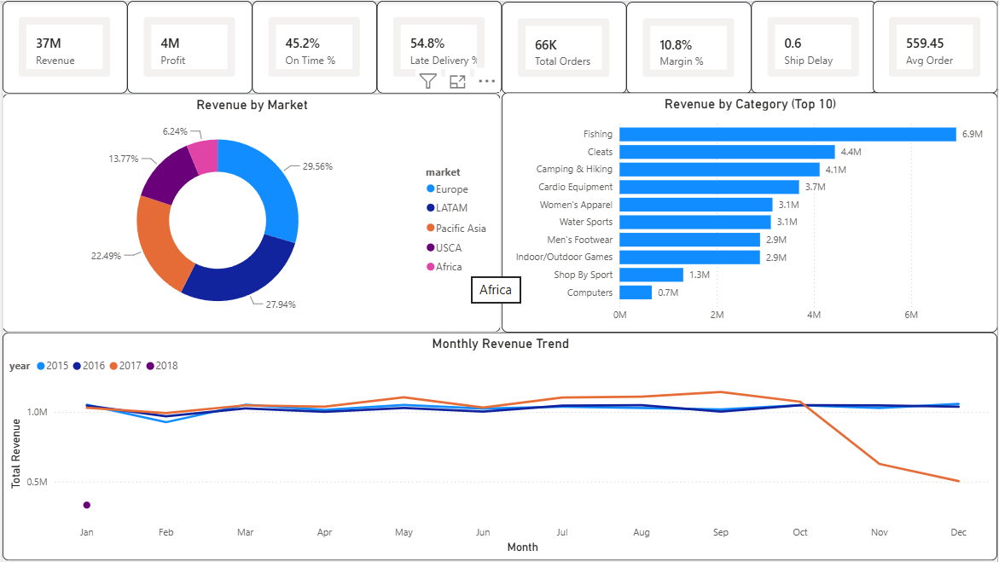
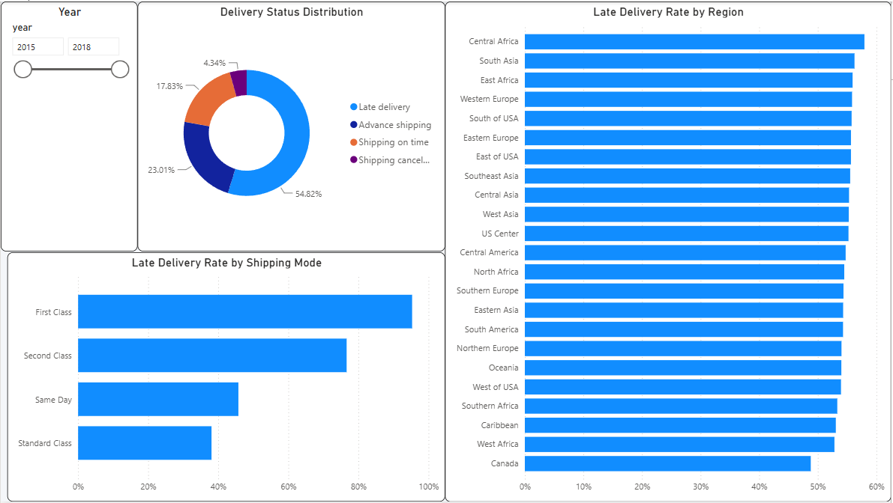
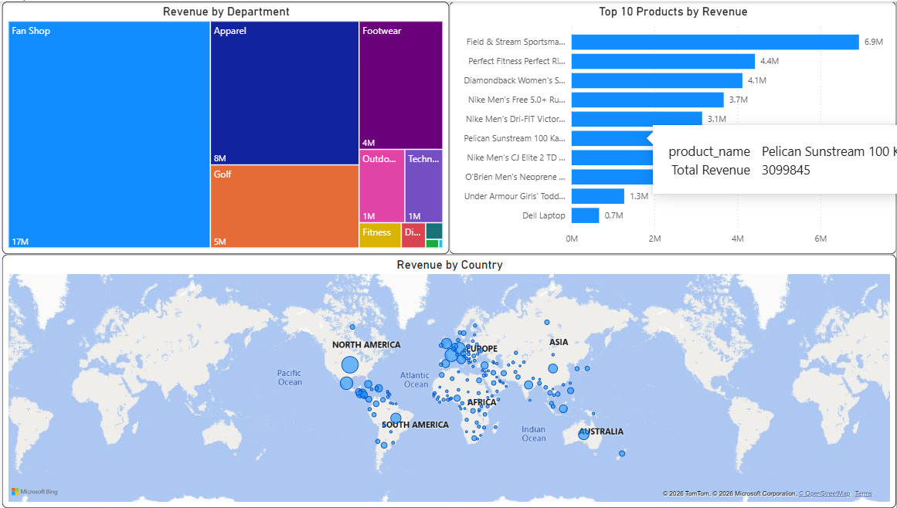

# Supply Chain Performance Analysis
**Tool:** Power BI | **Data Source:** DataCo Global Supply Chain Dataset | **Rows:** 180,519

## Project Overview
This project analyzes a global supply chain dataset to identify performance bottlenecks, revenue drivers, and shipping inefficiencies. The goal is to provide actionable insights for supply chain managers through an interactive Power BI dashboard.

The analysis answers three core business questions:
- **Where is the money coming from?** — Revenue by category, product, market, and department
- **Are shipments arriving on time?** — Late delivery rates by region and shipping mode
- **Which products and markets drive growth?** — Top performers and geographic distribution

---

## Dataset
- **Source:** [DataCo SMART SUPPLY CHAIN FOR BIG DATA ANALYSIS](https://www.kaggle.com/datasets/shashwatwork/dataco-global-supply-chain-dataset)
- **Size:** 180,519 rows × 53 columns
- **Period:** 2015–2018
- **Content:** Orders, customers, products, shipping, and financial data

---

## Data Model — Star Schema
The raw flat CSV was transformed into a star schema with one fact table and four dimension tables:

```
Fact_Orders (180,519 rows)
    ├── Dim_Customer    (20,652 rows)  — customer_id
    ├── Dim_Product     (118 rows)     — product_card_id
    ├── Dim_Geography   (3,716 rows)   — geography_id (surrogate key)
    └── Dim_Date        (1,461 rows)   — order_date
```

**Key design decisions:**
- `Dim_Geography` uses a **surrogate key** (`geography_id`) generated via Power Query index, since there was no natural single-column key for the region+country+city combination
- `Dim_Date` was generated programmatically in M code using `List.Dates()` to enable time intelligence DAX functions
- All transformations were done in **Power Query (M)** using the Advanced Editor for reproducibility and clean step history

---

## DAX Measures
| Measure | Formula Logic |
|---|---|
| `Total Revenue` | SUM of sales |
| `Total Profit` | SUM of order profit |
| `Profit Margin %` | Total Profit / Total Revenue |
| `Total Orders` | DISTINCTCOUNT of order_id |
| `Avg Order Value` | Total Revenue / Total Orders |
| `Late Delivery Rate %` | Orders with late_delivery_risk = 1 / Total orders |
| `On Time Delivery Rate %` | 1 - Late Delivery Rate % |
| `Avg Shipping Delay` | AVG(days_shipping_real) - AVG(days_shipping_scheduled) |

---

## Dashboard — 3 Pages

### 1. Executive Overview


Key KPIs at a glance, monthly revenue trend by year, top 10 categories by revenue, and revenue distribution by market.

### 2. Shipping Performance


Delivery status breakdown, late delivery rate by shipping mode and region. Includes a year slicer for dynamic filtering.

### 3. Product & Market Analysis


Revenue by department (treemap), top 10 products, and global revenue distribution map.

---

## Key Insights
- **54.8% of shipments are late** — more than half of all orders experience delivery delays
- **First Class has the highest late delivery rate (~80%)** — counterintuitively, faster shipping modes promise tighter windows and miss them more often
- **Fan Shop dominates revenue ($17M out of $37M total)** — nearly half of all revenue comes from a single department
- **Europe is the largest market (29.56%)** followed closely by LATAM (27.94%)
- **Field & Stream Sports Combo is the #1 product** with $6.9M in revenue — nearly double the second-ranked product

---

## Tools & Skills Used
- **Power BI Desktop** — data modeling, DAX, dashboard design
- **Power Query (M)** — data cleaning, transformation, star schema creation
- **DAX** — calculated measures, time intelligence
- **Data Modeling** — star schema, surrogate key generation, relationship management

---

## Project Structure
```
supply-chain-analysis/
│
├── README.md
├── supply_chain_analysis.pbix
└── screenshots/
    ├── executive_overview.png
    ├── shipping_performance.png
    ├── product_market_analysis.png
    └── data_model.png
```

---

## How to Use
1. Download the dataset from [Kaggle](https://www.kaggle.com/datasets/shashwatwork/dataco-global-supply-chain-dataset)
2. Open `supply_chain_analysis.pbix` in Power BI Desktop
3. Update the data source path: **Transform Data** → **Data source settings** → update file path
4. Click **Refresh** to load the data

---

*This project is part of my Data Analyst portfolio. Next project: rebuilding the ETL pipeline in SQL with Power BI for visualization.*
